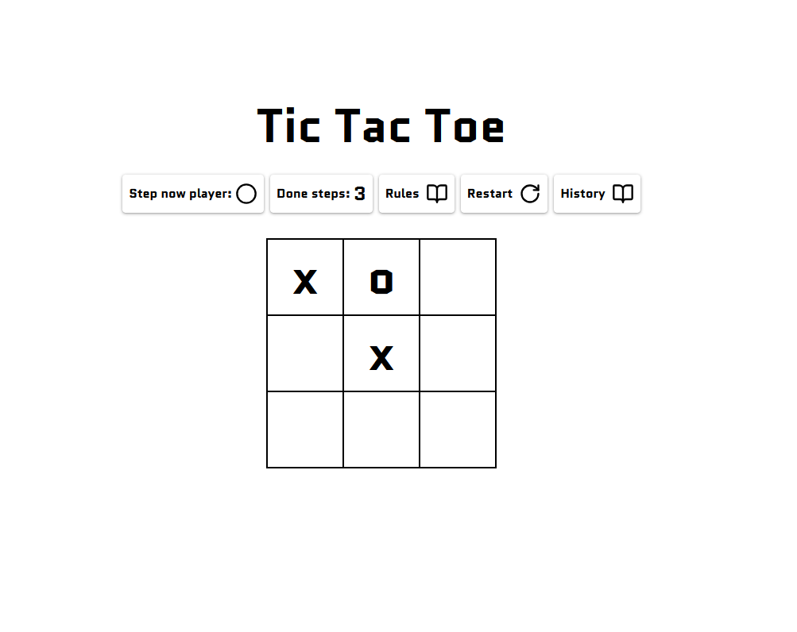
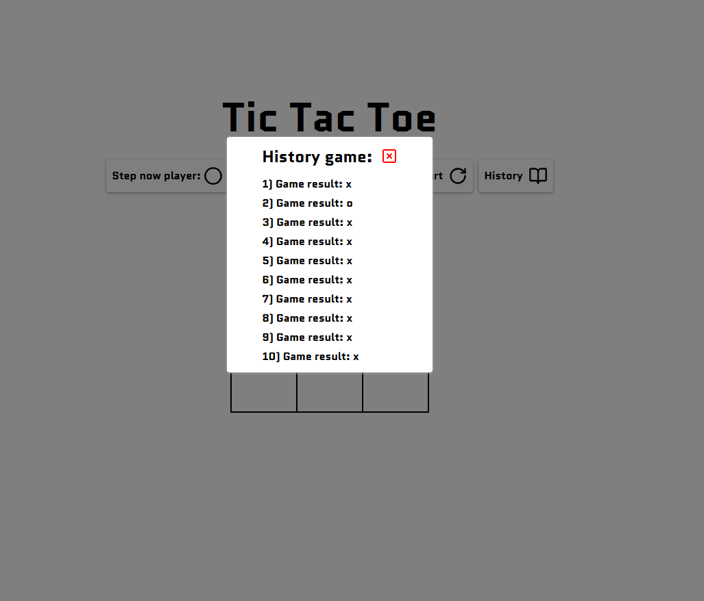
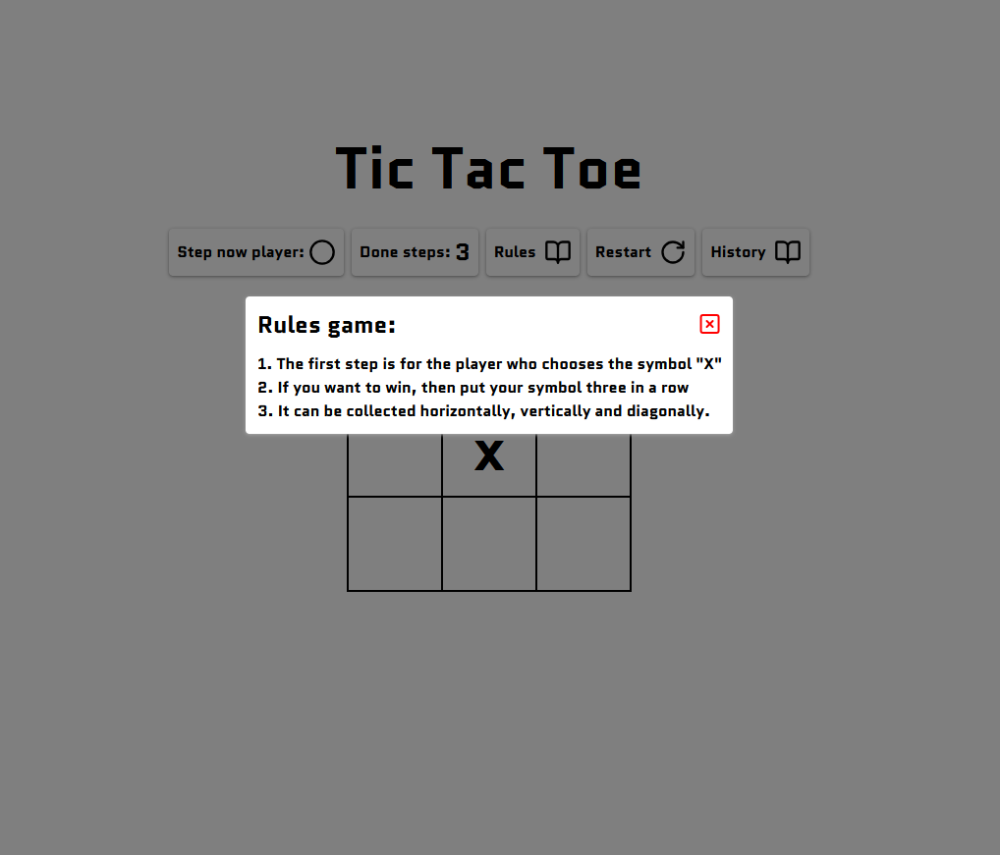

# TicTacToe

A minimalist Tic‑Tac‑Toe game with state management and a clean UI.

     

## ✨ Features
- ⚡ Instant gameplay with responsive grid interactions
- 🧠 Simple, reliable state management with Zustand
- 🎯 Win & draw detection, turn indicator, and restart flow
- 🎬 Subtle UI animations powered by Framer Motion
- 🧩 Clean, componentized architecture (Vite + React + TS)

## 🗂️ Project Structure (excerpt)
- `./` —
- `tic-tac-toe-main/` — .gitignore, .prettierrc, README.md, eslint.config.js, index.html, package.json, pnpm-lock.yaml, tsconfig.app.json, tsconfig.json, tsconfig.node.json, vite.config.ts
- `tic-tac-toe-main/src/` — App.tsx, index.css, main.tsx
- `tic-tac-toe-main/src/components/` — Bar.tsx, ListHistoryGame.tsx, Modal.tsx, TextWinner.tsx, Title.tsx
- `tic-tac-toe-main/src/hooks/` — useGameLogic.ts
- `tic-tac-toe-main/src/store/` — store.ts
- `tic-tac-toe-main/src/types/` — global.types.ts

## 🚀 Getting Started

### Prerequisites
- Node.js 18+
- npm / pnpm / yarn

### Setup
```bash
git clone <your-fork-url>
cd tic-tac-toe
npm install
npm run dev
```

### Build
```bash
npm run build
```

### Lint
```bash
npm run lint
```

## 🧩 Tech Stack
- React, TypeScript, Zustand, Tailwind CSS, lucide-react, Framer Motion
- Vite for fast dev server and bundling

## 📦 Scripts
- `dev` — `vite`
- `build` — `tsc -b && vite build`
- `lint` — `eslint .`
- `preview` — `vite preview`

## 🔌 Example: Using the History Store
```tsx
import { useHistoryStore } from '@/store/store';

const add = useHistoryStore(s => s.addGameResult);
add('x'); // store last winner
```

## 🧠 Game Logic Highlights
- Immutable grid updates
- Winner detection (rows, columns, diagonals)
- Draw detection when the board is full
- History of match results (with last 10 shown)

## 🎬 Animations (Framer Motion)
- Micro-interactions for buttons and modals
- Spring-based transitions for smooth feedback
- Easily extendable variants for hover/press/appear

## 📸 Screenshots
<p>
  
  
  
</p>

## 🧪 Ideas to Improve
- CPU opponent (minimax with depth cap)
- Score board and session persistence (localStorage)
- Sound effects & richer animations
- NxN boards and custom win-length
- Shareable match link & rematch flow

## 🛡️ License
MIT — feel free to fork and build on it.

---

Built with ❤️ and a love for tiny games.
